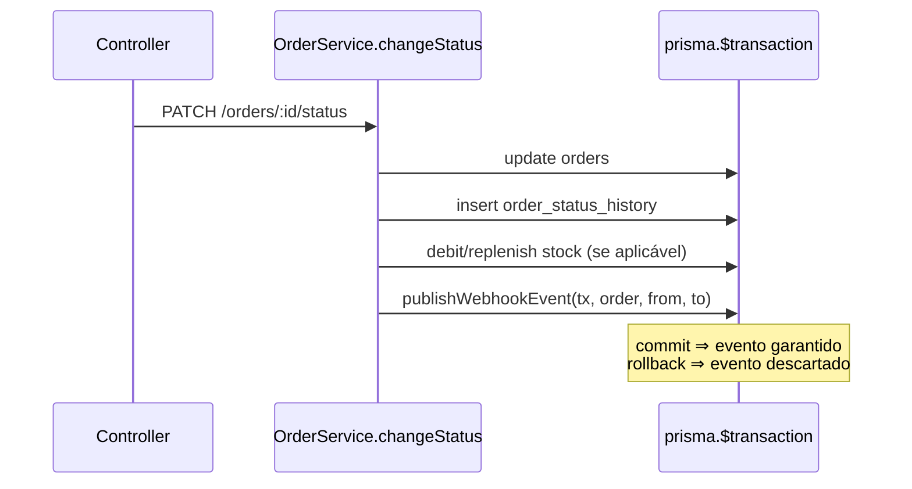

# FDD — Sistema de Webhooks de Notificação de Pedidos

| Campo | Valor |
|---|---|
| **Autor** | Anderson Silva |
| **Data de elaboração** | 2026-08-15 |
| **Status** | Em elaboração para revisão técnica |
| **Documentos relacionados** | [PRD](PRD.md) · [RFC](RFC.md) · [ADRs](adrs/) · [Tracker](TRACKER.md) |

> Convenção deste documento: itens marcados como **[proposta]** são detalhes de design derivados de uma decisão da reunião ou de um padrão do código, mas cujo formato exato **não** foi fechado na reunião e está pendente de confirmação. Tudo o mais é decisão ou requisito com origem direta na transcrição ou no código (ver [Tracker](TRACKER.md)).

## 1. Contexto e motivação técnica

Clientes B2B hoje fazem polling em `GET /orders` para detectar mudanças de status, o que é lento e caro para eles ([09:00] Marcos). O OMS não possui nenhum mecanismo de eventos ou notificação externa. A mudança de status é uma transação Prisma em `src/modules/orders/order.service.ts#changeStatus` que atualiza `orders`, insere em `order_status_history` e ajusta estoque — a feature precisa se acoplar a essa transação sem quebrá-la ([09:04] Bruno; [09:40] Bruno).

A solução decidida: outbox transacional no MySQL ([ADR-001](adrs/ADR-001-outbox-no-mysql.md)), worker separado em polling de 2s ([ADR-005](adrs/ADR-005-worker-separado-com-polling.md)), retry com backoff e DLQ ([ADR-002](adrs/ADR-002-retry-com-backoff-e-dlq.md)), HMAC-SHA256 com secret por endpoint ([ADR-003](adrs/ADR-003-autenticacao-hmac-por-endpoint.md)), entrega at-least-once ([ADR-004](adrs/ADR-004-entrega-at-least-once.md)) e reuso dos padrões do projeto ([ADR-006](adrs/ADR-006-reuso-dos-padroes-do-projeto.md)).

## 2. Objetivos técnicos

- Notificar endpoints externos em menos de 10 segundos após a mudança de status ([09:02] Marcos), sem acoplar chamadas HTTP à transação de negócio.
- Garantir que evento e mudança de status sejam atômicos: nunca status sem evento, nunca evento sem status ([09:40]–[09:41] Bruno/Diego).
- Entregar at-least-once com deduplicação viável pelo cliente ([09:24]–[09:26]).
- Oferecer CRUD completo de configuração, histórico de entregas, rotação de secret e replay de DLQ ([09:31]–[09:36]).
- Zero infraestrutura nova; aderência total aos padrões do repositório ([09:30] Larissa).

## 3. Escopo e exclusões

**No escopo:** tabelas `webhook_outbox`, `webhook_dead_letter` e configuração de webhooks; worker `src/worker.ts`; integração no `changeStatus`; endpoints de CRUD, deliveries, rotação de secret e replay admin; assinatura HMAC; retry/backoff/DLQ; observabilidade via Pino.

**Fora do escopo** (decidido na reunião):

- Notificação por email em falhas recorrentes — próxima fase ([09:37] Larissa).
- Rate limiting de envio — "observar e decidir depois" ([09:39] Larissa).
- Dashboard/painel visual — projeto separado do time de frontend ([09:40] Larissa).
- Arquivamento de linhas entregues da outbox — sugerido "depois de 30 dias ou assim", explicitamente fora do escopo; **não** é política fechada ([09:08] Diego).
- Webhooks inbound (recebimento) — escopo é só outbound ([09:02] Marcos).

## 4. Modelagem de dados — [proposta]

Nomes de modelos/campos abaixo são **convenção proposta**, derivada dos campos ditos na reunião ([09:21] url+secret+customer_id+ativo; [09:08] status do evento e created_at; [09:18] payload, motivo, timestamp; [09:34] histórico com sucesso/falha, payload, response, tempo de resposta) e do padrão de `prisma/schema.prisma` (UUID `@db.Char(36)`, `@@map` snake_case, índices explícitos):

```prisma
// [proposta] — nomes e tipos a confirmar na revisão de design
enum WebhookEventStatus { PENDING PROCESSING FAILED DELIVERED }

model WebhookEndpoint {
  id           String   @id @default(uuid()) @db.Char(36)
  customerId   String   @db.Char(36)
  url          String   @db.VarChar(2048)   // somente https [09:23]
  secret       String   @db.VarChar(255)    // gerada pela plataforma [09:31]
  previousSecret          String?  @db.VarChar(255) // rotação [09:21]
  previousSecretExpiresAt DateTime?                 // grace period 24h [09:21]
  statuses     Json      // filtro de eventos: lista de OrderStatus [09:33]
  active       Boolean  @default(true)
  createdAt    DateTime @default(now())
  updatedAt    DateTime @updatedAt
  @@index([customerId])
  @@map("webhook_endpoints")
}

model WebhookOutbox {
  id            String   @id @default(uuid()) @db.Char(36) // event_id [09:25]
  webhookId     String   @db.Char(36)
  orderId       String   @db.Char(36)
  eventType     String   @db.VarChar(64)   // "order.status_changed" [09:43]
  payload       Json     // snapshot renderizado na inserção [09:52]
  status        WebhookEventStatus @default(PENDING)
  attemptCount  Int      @default(0)
  nextAttemptAt DateTime @default(now())
  createdAt     DateTime @default(now())
  @@index([status])      // [09:08]
  @@index([createdAt])   // [09:08]
  @@map("webhook_outbox")
}

model WebhookDelivery {
  id           String   @id @default(uuid()) @db.Char(36)
  webhookId    String   @db.Char(36)
  eventId      String   @db.Char(36)  // payload do evento resolvido via outbox [09:34]
  success      Boolean
  httpStatus   Int?
  responseBody String?  @db.Text
  durationMs   Int
  attempt      Int
  createdAt    DateTime @default(now())
  @@index([webhookId])
  @@map("webhook_deliveries")
}

model WebhookDeadLetter {
  id        String   @id @default(uuid()) @db.Char(36)
  eventId   String   @db.Char(36)
  webhookId String   @db.Char(36)
  payload   Json     // [09:18]
  reason    String   @db.VarChar(500) // motivo da falha [09:18]
  failedAt  DateTime @default(now())  // timestamp [09:18]
  @@map("webhook_dead_letter")
}
```

**[proposta/pendente]** A forma de armazenamento da secret (texto claro vs. cifrada) não foi discutida na reunião; fica para a revisão de segurança da Sofia ([09:46]).

## 5. Fluxos detalhados

### FDD-FLUXO-01 — Mudança de status e criação atômica do evento

`changeStatus` (em `src/modules/orders/order.service.ts`) passa a chamar, **dentro da mesma `prisma.$transaction`**, a função `publishWebhookEvent(tx, order, fromStatus, toStatus)` — função pura que recebe o `tx` client da transação corrente, sem injetar repository inteiro ([09:41] Bruno/Diego). Se a inserção na outbox falhar, a transação inteira sofre rollback ([09:40] Bruno).



### FDD-FLUXO-02 — Filtragem por status na inserção

`publishWebhookEvent` consulta os webhooks **ativos** do customer do pedido e o filtro de status de cada um. Insere **uma linha de outbox por webhook interessado** naquele `toStatus`; se nenhum webhook do customer assina o status, **nada é inserido** — economiza linhas na tabela ([09:33]–[09:34] Marcos/Bruno/Diego). O payload é renderizado (snapshot) neste momento ([09:52]).

### FDD-FLUXO-03 — Polling e processamento pelo worker

Worker (`src/worker.ts`, processo separado, `PrismaClient` próprio — [09:11], [09:30]) em loop: a cada **2 segundos** busca os eventos `PENDING` mais antigos (ordem de `createdAt`, batch pequeno — [09:08]–[09:09]), marca como `PROCESSING`, entrega e marca o desfecho. Single-worker: ordering por `order_id` vale nessa configuração **e apenas na ausência de retries** ([09:12]–[09:13] fecharam a limitação quanto a múltiplos workers; a interação com retries é análise posterior). **Limitação adicional (análise posterior, não discutida na reunião):** o retry com backoff quebra a ordering por pedido mesmo em single-worker — se um evento do pedido X falha e aguarda backoff, um evento posterior do mesmo pedido pode ser entregue antes. A ordering por pedido deve, portanto, ser tratada como **melhor esforço**, não como garantia. **[proposta em aberto]** mitigação possível: reter eventos posteriores de um pedido enquanto existir evento anterior do mesmo pedido em retry (garante ordem ao custo de atrasar eventos subsequentes e acoplar o backoff por pedido) — pendente de decisão do time; enquanto isso, o cliente pode reordenar pelo `timestamp` do payload ou pela máquina de estados do pedido.

### FDD-FLUXO-04 — Assinatura e entrega HTTP

1. Serializa o payload (snapshot já armazenado) como JSON.
2. Calcula `HMAC-SHA256(secret_do_endpoint, corpo_exato_em_bytes)` ([09:20]–[09:22] Sofia). Durante o grace period de rotação, a **[proposta]** é assinar com a secret nova, mantendo a antiga apenas como válida para o cliente durante a migração (a reunião fechou que a antiga "fica válida por 24 horas em paralelo" [09:21], mas não detalhou o comportamento de assinatura nesse intervalo; ver FDD-FLUXO-09).
3. Faz `POST` na URL `https` do endpoint com os headers do contrato FDD-CONTRATO-08 e **timeout de 10 segundos** ([09:42] Diego).
4. Payload acima de **64 KB** não é enviado: tratado como erro ([09:23] Sofia; [09:24] Diego/Larissa).

### FDD-FLUXO-05 — Sucesso e persistência do histórico

Resposta HTTP 2xx dentro do timeout ⇒ evento marcado `DELIVERED` na outbox e registro em `webhook_deliveries` com sucesso, status HTTP, response, tempo de resposta e número da tentativa ([09:34] Marcos — base do `GET /webhooks/:id/deliveries`).

### FDD-FLUXO-06 — Falha, agendamento de retry e backoff

Timeout, erro de rede ou resposta não-2xx ⇒ registro de entrega com falha, incremento do contador de tentativas e agendamento de `nextAttemptAt` conforme a progressão **1m / 5m / 30m / 2h / 12h** ([09:17] Larissa — intervalos exatos, sem arredondamento).

**Ambiguidade registrada (não resolver silenciosamente):** a reunião fechou "**5 tentativas**" ([09:17] Larissa) e também **5 intervalos** de backoff. As duas leituras possíveis:

- (a) **5 envios totais** ⇒ apenas 4 intervalos seriam consumidos (12h nunca usado);
- (b) **1 envio inicial + 5 retentativas** ⇒ 6 envios totais, consumindo os 5 intervalos.

A fala de Diego — "total de quase 15 horas entre primeira falha e última tentativa" ([09:17]), soma exata dos 5 intervalos (14h36m) — só fecha com a leitura **(b)**. **Interpretação recomendada [proposta, pendente de confirmação]: leitura (b).** Nessa interpretação o contador funciona assim: `attemptCount` conta **envios realizados**; após o envio inicial falho (`attemptCount = 1`), as retentativas de número 1..5 são agendadas com os intervalos 1m, 5m, 30m, 2h e 12h respectivamente; falhou a retentativa 5 (`attemptCount = 6`) ⇒ DLQ.

### FDD-FLUXO-07 — Esgotamento e movimentação para DLQ

Esgotadas as tentativas, o worker move o evento para `webhook_dead_letter` com payload, motivo da última falha e timestamp ([09:18] Diego), e marca a linha da outbox como `FAILED`. **[proposta]** manter a linha na outbox marcada (em vez de deletar) preserva trilha; arquivamento fica fora do escopo ([09:08]).

### FDD-FLUXO-08 — Replay administrativo da DLQ

`POST /admin/webhooks/dead-letter/:id/replay` ([09:18], [09:35] Diego), restrito a role `ADMIN` via `requireRole('ADMIN')` já existente ([09:36] Larissa; `src/middlewares/auth.middleware.ts`). Recoloca o evento na outbox como `PENDING` (contador zerado — **[proposta]**) e **loga quem executou o replay, para auditoria** ([09:36] Sofia).

### FDD-FLUXO-09 — Rotação de secret com grace period de 24h

1. Cliente chama o endpoint de rotação (FDD-CONTRATO-06).
2. Plataforma gera secret nova, move a atual para `previousSecret` com `previousSecretExpiresAt = agora + 24h` ([09:21] Sofia).
3. Resposta devolve a secret nova (mesmo comportamento da criação, [09:31]).
4. A antiga permanece **válida** por 24h para o cliente concluir a migração; depois disso, expira ([09:21] Sofia). **[proposta]** envios passam a ser assinados com a secret nova imediatamente (o comportamento exato de assinatura durante o grace não foi fechado na reunião — pendente de confirmação na revisão de segurança) e um job/verificação do worker limpa `previousSecret` expirada.

## 6. Contratos públicos

Convenções observadas no código e reutilizadas: prefixo `/api/v1` (`src/app.ts`), autenticação Bearer JWT via `authenticate`, validação Zod via `validate` middleware, envelope de erro `{ "error": { "code", "message", "details?" } }` (`src/middlewares/error.middleware.ts`), paginação `{ data, pagination }` (`src/shared/http/response.ts`). Paths e envelopes não ditos literalmente na reunião estão marcados como **[convenção proposta no FDD]**, ancorados no requisito de origem e nos padrões do código.

Autorização: CRUD de configuração exige apenas usuário autenticado, qualquer role ([09:36]–[09:37] Marcos/Sofia); somente o replay de DLQ exige `ADMIN` ([09:36]).

### FDD-CONTRATO-01 — Criar configuração de webhook

- **Método/Path:** `POST /api/v1/webhooks` **[convenção proposta]** (necessidade de origem: [09:31] Marcos)
- **Auth:** Bearer JWT (qualquer role). `customerId` vai no body — não vem do JWT, que é do usuário operador ([09:32] Larissa/Bruno).
- **Request:**

```json
{
  "customerId": "9b2f61e2-4a3e-4c9b-8e01-1f6a2d3c4b5a",
  "url": "https://api.cliente.com/webhooks/oms",
  "statuses": ["SHIPPED", "DELIVERED"]
}
```

- **Response `201 Created`** — a secret é **gerada pela plataforma e devolvida na criação** ([09:31] Marcos):

```json
{
  "id": "0d7c5c2a-93f1-4d55-a6e2-77f0b6f0c111",
  "customerId": "9b2f61e2-4a3e-4c9b-8e01-1f6a2d3c4b5a",
  "url": "https://api.cliente.com/webhooks/oms",
  "statuses": ["SHIPPED", "DELIVERED"],
  "active": true,
  "secret": "whsec_9f2c...c0de",
  "createdAt": "2026-08-15T12:00:00.000Z"
}
```

- **Status codes:** `201` criado · `400` validação (ex.: URL `http` ⇒ `WEBHOOK_INVALID_URL`) · `401` sem token · `404` customer inexistente.
- **Semântica:** a secret completa só aparece nesta resposta e na rotação **[proposta]**.

### FDD-CONTRATO-02 — Listar webhooks de um cliente

- **Método/Path:** `GET /api/v1/webhooks?customerId=<uuid>` **[convenção proposta]** (origem: [09:33] Bruno — "GET pra listar os webhooks de um customer")
- **Auth:** Bearer JWT (qualquer role).
- **Response `200 OK`** (padrão paginado do projeto, `src/shared/http/response.ts`):

```json
{
  "data": [
    {
      "id": "0d7c5c2a-93f1-4d55-a6e2-77f0b6f0c111",
      "customerId": "9b2f61e2-4a3e-4c9b-8e01-1f6a2d3c4b5a",
      "url": "https://api.cliente.com/webhooks/oms",
      "statuses": ["SHIPPED", "DELIVERED"],
      "active": true,
      "createdAt": "2026-08-15T12:00:00.000Z"
    }
  ],
  "pagination": { "page": 1, "pageSize": 20, "total": 1, "totalPages": 1 }
}
```

- **Status codes:** `200` · `400` query inválida · `401`. A secret **não** é retornada na listagem **[proposta]**.

### FDD-CONTRATO-03 — Editar configuração / filtro de eventos

- **Método/Path:** `PATCH /api/v1/webhooks/:id` **[convenção proposta]** (origem: [09:33] Bruno — "PATCH pra editar"; filtro por endpoint: [09:33] Marcos)
- **Auth:** Bearer JWT (qualquer role).
- **Request** (campos opcionais, padrão `updateProductSchema.partial()` de `src/modules/products/product.schemas.ts`):

```json
{ "url": "https://api.cliente.com/v2/webhooks", "statuses": ["PAID", "SHIPPED", "DELIVERED"], "active": true }
```

- **Response `200 OK`:** objeto atualizado (sem secret).
- **Status codes:** `200` · `400` (`WEBHOOK_INVALID_URL` para URL não-https) · `401` · `404` (`WEBHOOK_NOT_FOUND`).

### FDD-CONTRATO-04 — Remover webhook

- **Método/Path:** `DELETE /api/v1/webhooks/:id` **[convenção proposta]** (origem: [09:33] Bruno — "DELETE pra remover")
- **Auth:** Bearer JWT (qualquer role).
- **Response:** `204 No Content` (padrão do projeto, ex.: `OrderController.delete`).
- **Status codes:** `204` · `401` · `404` (`WEBHOOK_NOT_FOUND`).

### FDD-CONTRATO-05 — Consultar histórico de entregas

- **Método/Path:** `GET /api/v1/webhooks/:id/deliveries` (path dito na reunião: "GET /webhooks/:id/deliveries", [09:34] Marcos; prefixo `/api/v1` do código)
- **Auth:** Bearer JWT (qualquer role).
- **Query [proposta]:** paginação padrão (`page`, `pageSize` até 100), permitindo "os últimos 100" ([09:34]).
- **Response `200 OK`:**

```json
{
  "data": [
    {
      "id": "3fa2b8d0-...",
      "eventId": "b31c07a4-...",
      "success": false,
      "httpStatus": 503,
      "payload": {
        "event_id": "b31c07a4-...",
        "event_type": "order.status_changed",
        "order_id": "1a2b3c4d-...",
        "to_status": "SHIPPED"
      },
      "responseBody": "Service Unavailable",
      "durationMs": 812,
      "attempt": 2,
      "createdAt": "2026-08-15T12:05:07.000Z"
    }
  ],
  "pagination": { "page": 1, "pageSize": 20, "total": 42, "totalPages": 3 }
}
```

- **Status codes:** `200` · `401` · `404` (`WEBHOOK_NOT_FOUND`).
- **Semântica:** cobre "sucesso/falha, payload, response, tempo de resposta" ([09:34]). O `payload` retornado é o snapshot do evento, resolvido a partir da outbox pelo `eventId` no momento da consulta — **[proposta]** para evitar duplicar o armazenamento do payload em `webhook_deliveries` (a linha da outbox é preservada mesmo após entrega/falha; arquivamento está fora do escopo, [09:08]).

### FDD-CONTRATO-06 — Rotacionar secret

- **Método/Path:** `POST /api/v1/webhooks/:id/rotate-secret` **[convenção proposta]** (origem: [09:21] Sofia — "endpoint pro cliente conseguir pedir nova secret pela API")
- **Auth:** Bearer JWT (qualquer role).
- **Request:** corpo vazio.
- **Response `200 OK`:**

```json
{
  "id": "0d7c5c2a-93f1-4d55-a6e2-77f0b6f0c111",
  "secret": "whsec_a11e...9bd2",
  "previousSecretExpiresAt": "2026-08-16T12:00:00.000Z"
}
```

- **Status codes:** `200` · `401` · `404` (`WEBHOOK_NOT_FOUND`).
- **Semântica:** secret antiga válida por 24h em paralelo; depois expira ([09:21] Sofia).

### FDD-CONTRATO-07 — Replay de item da DLQ (admin)

- **Método/Path:** `POST /api/v1/admin/webhooks/dead-letter/:id/replay` (path dito na reunião: "POST /admin/webhooks/dead-letter/:id/replay", [09:18]/[09:35] Diego; prefixo `/api/v1` do código)
- **Auth:** Bearer JWT com **role `ADMIN`** via `requireRole('ADMIN')` ([09:36] Sofia/Larissa).
- **Request:** corpo vazio.
- **Response `200 OK` [proposta]:**

```json
{ "deadLetterId": "77a0c9e2-...", "eventId": "b31c07a4-...", "status": "PENDING", "replayedBy": "f6d1a2b3-..." }
```

- **Status codes:** `200` · `401` · `403` sem role ADMIN (`FORBIDDEN`, middleware existente) · `404` (`WEBHOOK_DEAD_LETTER_NOT_FOUND` **[proposto]**).
- **Semântica:** recoloca o evento na outbox como pendente ([09:18]) e **registra em log de auditoria o usuário que executou** ([09:36] Sofia).

### FDD-CONTRATO-08 — POST de entrega ao endpoint externo do cliente

- **Método/Path:** `POST <url do webhook cadastrado>` (somente `https`, [09:23]).
- **Headers** ([09:44] Diego; [09:44] Sofia):

| Header | Conteúdo |
|---|---|
| `Content-Type` | `application/json` |
| `X-Event-Id` | UUID do evento, gerado na entrada da outbox ([09:25]) |
| `X-Signature` | HMAC-SHA256 sobre os **bytes exatos do corpo enviado**, com a secret do endpoint ([09:20]–[09:22]) |
| `X-Timestamp` | Timestamp do envio — para o cliente poder detectar replay se quiser ([09:44]). **Não participa da assinatura** (a reunião fechou HMAC sobre o corpo apenas; proteção completa contra replay é questão aberta — [RFC-QA-04](RFC.md#questões-em-aberto)) |
| `X-Webhook-Id` | ID do cadastro de webhook, para cliente com vários endpoints ([09:44] Sofia) |

- **Payload** (campos decididos em [09:43] Diego — sem `items`, para não inflar; detalhes via `GET /orders/:id`):

```json
{
  "event_id": "b31c07a4-2c1d-4e8f-9a3b-5d6e7f8a9b0c",
  "event_type": "order.status_changed",
  "timestamp": "2026-08-15T12:03:04.000Z",
  "order_id": "1a2b3c4d-...",
  "order_number": "ORD-000042",
  "from_status": "PROCESSING",
  "to_status": "SHIPPED",
  "customer_id": "9b2f61e2-...",
  "total_cents": 15500
}
```

- **Limites e semântica:** corpo máximo de **64 KB** — acima disso o envio é tratado como erro, não truncado ([09:23]–[09:24]); **timeout de 10 segundos** — sem resposta, é falha e vai para retry ([09:42]); resposta 2xx = sucesso, qualquer outra coisa = falha **[proposta de semântica, derivada de 09:42]**; garantia **at-least-once** — o consumidor é responsável por deduplicar pelo `X-Event-Id` ([09:24]–[09:26]).

## 7. Matriz de erros `WEBHOOK_*`

Códigos citados na reunião: `WEBHOOK_NOT_FOUND`, `WEBHOOK_INVALID_URL`, `WEBHOOK_SECRET_REQUIRED` ([09:28] Bruno, com "etc." indicando lista não exaustiva). Os demais são **[propostos]**, derivados dos contratos acima e do padrão de erros do código (`AppError` + subclasses de `src/shared/errors/http-errors.ts`). Nenhuma classe nova exige mudança em `app-error.ts`; a **proposta** é especializar subclasses no próprio módulo (ex.: `webhook.errors.ts`), reutilizando `NotFoundError`, `ValidationError`, `ConflictError`, `UnprocessableEntityError`.

| ID | Código | HTTP | Condição | Mensagem conceitual | Ação esperada do cliente |
|---|---|---|---|---|---|
| FDD-ERR-01 | `WEBHOOK_NOT_FOUND` ([09:28]) | 404 | Webhook `:id` inexistente nos contratos 03–06 | "Webhook not found" | Verificar o ID; listar webhooks do customer |
| FDD-ERR-02 | `WEBHOOK_INVALID_URL` ([09:28]) | 400 | URL não-`https` ou malformada no cadastro/edição ([09:23]) | "Webhook URL must be a valid https URL" | Corrigir a URL para `https` |
| FDD-ERR-03 | `WEBHOOK_SECRET_REQUIRED` ([09:28]) | 400 | Operação que exige secret vigente sem que exista uma válida — condição exata **[proposta]**, código citado na reunião | "Webhook secret is required" | Rotacionar/regenerar a secret |
| FDD-ERR-04 | `WEBHOOK_INVALID_STATUS_FILTER` **[proposto]** | 400 | `statuses` com valor fora do enum `OrderStatus` de `prisma/schema.prisma` | "Invalid status in event filter" | Usar apenas status válidos do pedido |
| FDD-ERR-05 | `WEBHOOK_PAYLOAD_TOO_LARGE` **[proposto]** | — (erro interno de entrega; evento marcado como falha ⇒ retry/DLQ) | Payload renderizado excede 64 KB ([09:23]–[09:24]) | "Webhook payload exceeds 64KB limit" | N/A (tratado no nosso lado; visível no histórico de entregas e na DLQ) |
| FDD-ERR-06 | `WEBHOOK_DELIVERY_TIMEOUT` **[proposto]** | — (motivo de falha registrado na entrega/DLQ) | Endpoint do cliente não respondeu em 10s ([09:42]) | "Delivery timed out after 10s" | Cliente deve responder em <10s |
| FDD-ERR-07 | `WEBHOOK_DEAD_LETTER_NOT_FOUND` **[proposto]** | 404 | `:id` inexistente no replay (contrato 07) | "Dead letter item not found" | Verificar o ID na DLQ |
| FDD-ERR-08 | `WEBHOOK_ALREADY_INACTIVE` **[proposto]** | 409 | Operação sobre webhook desativado quando aplicável — nos moldes de `ConflictError` do código | "Webhook is inactive" | Reativar via PATCH antes de operar |

Erros transversais continuam com o middleware existente: `VALIDATION_ERROR` (Zod), `UNAUTHORIZED`, `FORBIDDEN`, `NOT_FOUND`, `INTERNAL_SERVER_ERROR` (`src/middlewares/error.middleware.ts`).

## 8. Estratégias de resiliência

| ID | Estratégia | Detalhe |
|---|---|---|
| FDD-RES-01 | Timeout de entrega | 10 segundos por chamada HTTP; estouro = falha marcada para retry ([09:42] Diego) |
| FDD-RES-02 | Retry com backoff | Intervalos 1m/5m/30m/2h/12h, janela total ~15h ([09:17]); semântica do contador conforme FDD-FLUXO-06 (interpretação (b), pendente de confirmação) |
| FDD-RES-03 | DLQ + replay | Falha permanente isolada em `webhook_dead_letter`; reprocessamento manual admin ([09:18], [09:36]) |
| FDD-RES-04 | Atomicidade e consistência | Evento criado na transação de negócio; sem estados intermediários possíveis ([09:40]–[09:41]) |
| FDD-RES-05 | Isolamento de processo | Worker separado: deploy/restart da API não afeta a entrega ([09:11]) |
| FDD-RES-06 | Limite de payload | 64 KB, erro em vez de truncamento ([09:23]–[09:24]) |

Fallback de notificação (ex.: email após N falhas) foi **explicitamente adiado** para a próxima fase ([09:37]) — não há fallback nesta fase além do retry + DLQ.

## 9. Observabilidade

O projeto já possui: logs estruturados JSON com Pino (`src/shared/logger/index.ts`, com `redact` de campos sensíveis), request logging com `requestId`/`durationMs` (`src/middlewares/request-logger.middleware.ts`) e log de erro não tratado no middleware central. **Não há** métricas nem tracing hoje — o que segue para o worker é **[convenção de implementação proposta]**, fundamentada no requisito de <10s ([09:02]), no histórico de entregas ([09:34]) e no Pino existente:

- FDD-OBS-01 — **Logs (novos, no padrão Pino existente):** eventos `webhook_event_enqueued`, `webhook_delivery_attempt`, `webhook_delivery_succeeded`, `webhook_delivery_failed`, `webhook_event_dead_lettered`, `webhook_dlq_replayed` — sempre com `eventId`, `webhookId`, `orderId`, `attempt`, `durationMs`; no replay, com o `userId` do admin (auditoria exigida em [09:36]). Secrets jamais logadas: a lista `redact` atual de `src/shared/logger/index.ts` cobre `*.password`, `*.token`, `*.accessToken` etc., mas **não** cobre `secret`/`previousSecret` — a **[proposta]** é estender a lista com `*.secret` e `*.previousSecret` seguindo o padrão já existente.
- FDD-OBS-02 — **Métricas [propostas]:** `webhook_outbox_pending_count` (backlog), `webhook_delivery_duration_ms` (latência do POST), `webhook_end_to_end_latency_ms` (mudança de status → entrega, valida a meta de <10s), `webhook_delivery_failures_total`, `webhook_dlq_size`. Nomes são convenção proposta; o mecanismo de exposição (ex.: endpoint de métricas) não foi decidido na reunião e fica pendente.
- FDD-OBS-03 — **Tracing [proposto]:** propagar `eventId` como correlação em todos os logs do ciclo de vida do evento (equivalente ao `requestId` do HTTP hoje); tracing distribuído formal não existe no projeto e não foi decidido — registrado como possível evolução, não requisito.

## 10. Dependências e compatibilidade

- FDD-DEP-01 — **Runtime/stack:** Node.js ≥ 20, TypeScript, Express 4, Prisma 5.22 / MySQL, Zod, Pino, `uuid` — tudo já em `package.json`; nenhuma dependência nova é estritamente necessária (HMAC-SHA256 via `node:crypto`). Qualquer lib adicional (ex.: HTTP client) precisa de justificativa em revisão **[proposta]**.
- FDD-DEP-02 — **Banco:** novas tabelas via migration Prisma (padrão `prisma/migrations/`). Sem mudança nas tabelas existentes — apenas leitura de `orders`/`customers` na renderização do snapshot. Compatibilidade: nenhuma rota existente muda; `changeStatus` mantém contrato externo idêntico (a inserção na outbox é interna à transação).
- FDD-DEP-03 — **Processos:** novo processo worker (`npm run worker` **[proposta de script]**, [09:11] Larissa) ao lado da API. Mesmo `DATABASE_URL`; instância própria de `PrismaClient` ([09:30]).
- FDD-DEP-04 — **Configuração por ambiente [proposta]:** se intervalo de polling, batch size ou timeout virarem configuráveis, entram como variáveis validadas no schema Zod de `src/config/env.ts` — a reunião não decidiu variáveis de ambiente; os valores decididos (2s, 10s, 64KB) podem iniciar como constantes do módulo.

## 11. Critérios de aceite técnicos

- FDD-CA-01 — Rollback da transação de `changeStatus` não deixa nenhuma linha na outbox; commit sempre deixa exatamente as linhas dos webhooks interessados ([09:40]–[09:41]).
- FDD-CA-02 — Mudança de status não assinada por nenhum webhook do customer não insere linha na outbox ([09:34]).
- FDD-CA-03 — Evento entregue com sucesso gera registro em `webhook_deliveries` e não é reenviado (exceto duplicidade inerente ao at-least-once).
- FDD-CA-04 — Assinatura `X-Signature` validável pelo cliente com HMAC-SHA256 sobre os bytes exatos do corpo recebido ([09:20]–[09:22]).
- FDD-CA-05 — Endpoint que não responde em 10s gera falha e agendamento do retry seguinte na progressão 1m/5m/30m/2h/12h ([09:17], [09:42]).
- FDD-CA-06 — Esgotadas as tentativas (conforme semântica confirmada de FDD-FLUXO-06), o evento aparece em `webhook_dead_letter` com payload, motivo e timestamp ([09:18]).
- FDD-CA-07 — Replay de DLQ exige `ADMIN` (403 caso contrário), recoloca o evento como pendente e loga o usuário executor ([09:36]).
- FDD-CA-08 — Cadastro com URL `http` é recusado com `WEBHOOK_INVALID_URL` ([09:23]).
- FDD-CA-09 — Após rotação, a secret antiga permanece válida somente pelas 24h do grace period ([09:21]); a política de assinar imediatamente com a secret nova segue a proposta de FDD-FLUXO-09, **pendente de confirmação** na revisão de segurança.
- FDD-CA-10 — Payload que exceda 64 KB não é enviado e fica registrado como falha ([09:23]–[09:24]).
- FDD-CA-11 — Testes de integração seguem o padrão existente (`tests/orders.test.ts` + `tests/helpers/factories.ts` + `tests/setup.ts` com Vitest/Supertest), cobrindo os critérios acima **[proposta de abordagem]**.

## 12. Riscos e mitigação (técnicos)

- FDD-RISCO-01 — **Backlog na outbox sob pico** degradando latência: mitigado por índices em status/created_at e batch pequeno ([09:08]); monitorado pela métrica proposta de backlog; escala horizontal é evolução futura ([09:13]).
- FDD-RISCO-02 — **Crash do worker entre marcar `PROCESSING` e registrar desfecho** deixando eventos presos: mitigação **[proposta]** — na partida, worker devolve para `PENDING` eventos `PROCESSING` antigos; duplicidade resultante é coberta pelo at-least-once ([ADR-004](adrs/ADR-004-entrega-at-least-once.md)).
- FDD-RISCO-03 — **Replay attack na entrega**: `X-Timestamp` permite detecção pelo cliente, mas não participa da assinatura ([09:44]); registrado como questão aberta ([RFC-QA-04](RFC.md#questões-em-aberto)) para a revisão de segurança da Sofia ([09:46]).

## 13. Integração com o sistema existente

| ID | Caminho real | Integração |
|---|---|---|
| FDD-INT-01 | `src/modules/orders/order.service.ts` | Ponto crítico: `changeStatus` passa a chamar `publishWebhookEvent(tx, order, fromStatus, toStatus)` dentro da `prisma.$transaction` existente (que hoje faz `tx.order.update`, `tx.orderStatusHistory.create` e ajustes de estoque). Falha na outbox ⇒ rollback de tudo ([09:40]–[09:41]). |
| FDD-INT-02 | `prisma/schema.prisma` | Recebe os novos modelos da seção 4 (**proposta de modelagem**), seguindo os padrões do arquivo: `@id @default(uuid()) @db.Char(36)`, `@@map` snake_case, `@@index` explícitos, enums nativos. |
| FDD-INT-03 | `src/app.ts` | `buildControllers` compõe `WebhookRepository → WebhookService → WebhookController` como faz para os demais módulos; `Controllers` ganha a chave `webhooks` **[proposta]**. |
| FDD-INT-04 | `src/routes/index.ts` | `buildApiRouter` monta `router.use('/webhooks', buildWebhookRouter(...))` (e a rota admin de replay), no mesmo padrão dos módulos existentes. |
| FDD-INT-05 | `src/middlewares/auth.middleware.ts` | `authenticate` protege todas as rotas do módulo; `requireRole('ADMIN')` protege o replay da DLQ — mesmo uso já existente em `src/modules/users/user.routes.ts` ([09:36]). |
| FDD-INT-06 | `src/shared/errors/app-error.ts` e `src/shared/errors/http-errors.ts` | Hierarquia **reutilizada sem alteração**: `AppError` é a base; subclasses concretas (`NotFoundError`, `ConflictError`, `UnprocessableEntityError`...) já existem. Erros `WEBHOOK_*` entram como especializações no módulo de webhooks (**proposta**), como `InsufficientStockError` faz hoje ([09:28]–[09:29]). |
| FDD-INT-07 | `src/middlewares/error.middleware.ts` | Nenhuma mudança: já trata `AppError` (status + código), `ZodError` e erros Prisma — captura os erros do módulo "sem precisar mudar nada" ([09:29] Bruno). |
| FDD-INT-08 | `src/shared/logger/index.ts` | Logger Pino reutilizado pela API e pelo worker (mesmo `createLogger`) ([09:29]). A lista `redact` atual não cobre `secret`/`previousSecret`; a extensão com `*.secret`/`*.previousSecret` é **proposta** (ver FDD-OBS-01). |
| FDD-INT-09 | `src/config/database.ts` | Padrão `createPrismaClient()` reutilizado: o worker cria a **própria instância** por ser outro processo Node ([09:30]). |
| FDD-INT-10 | `tests/orders.test.ts`, `tests/helpers/factories.ts`, `tests/setup.ts` | Referência para os testes de integração do módulo: Supertest contra `buildApp`, factories de dados, limpeza por tabela no `beforeEach` (as novas tabelas entram na limpeza — **proposta**). |
